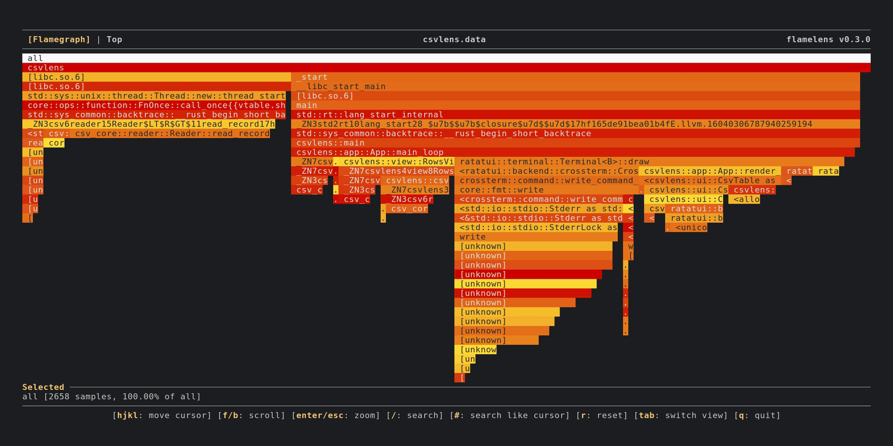

# v0.4.0

* Add public API for embedding `flamelens` as a library (#15 by @zz85)
* Update `py-spy` to 0.4.1 to support Python 3.12 and 3.13

# v0.3.1

* Fix colors for light theme terminals
* Fix sort column being reset incorrectly in live mode

# v0.3.0

* Add "top" view to show summary of slowest functions in a table:

  

* Add `--echo` option to allow integration with `cargo flamegraph` as the output viewer:

  ```
  cargo flamegraph --post-process 'flamelens --echo' [other cargo flamegraph arguments]
  ```

* Display key bindings in app

# v0.2.0

* Support selecting next and previous search results (`n` / `N`)
* Make footer section mutli-line and color coded for better readability
* Display an indicator if there are more frames to show by scrolling down

# v0.1.0

Initial release