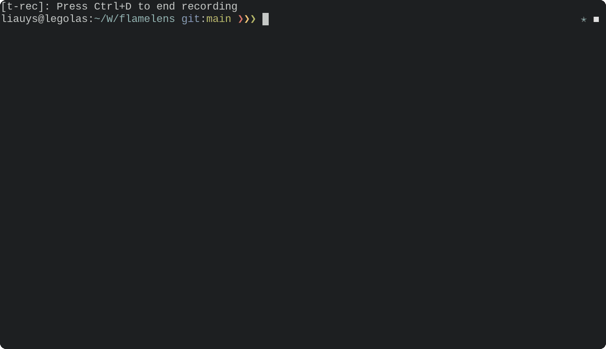

# flamelens

`flamelens` is an interactive FlameGraph viewer in the terminal.


## What is it?

FlameGraph tools such as [FlameGraph](https://github.com/brendangregg/FlameGraph) and
[inferno](https://github.com/jonhoo/inferno) process output from various profiling tools and
generate intermediate data in the "folded" format ready for FlameGraph plotting, typically as SVG
files. `flamelens` takes this data and generate an interactive FlameGraph in the terminal.

No more hauling SVG files and opening a browser just to have a quick look at the profiling result!

## Usage

Run `flamelens` with the filename of the profiling data in the form of "folded stacks":

```
flamelens <folded-stacks-filename>
```

You can also pipe data directly to `flamelens` without providing a filename.

### Python

Display a live FlameGraph of a running Python program using
[`py-spy`](https://github.com/benfred/py-spy) as the profiler:

```
flamelens --pid <pid-of-python-program>
```

This requires enabling the `python` feature when installing.

<details>

<summary>Example of a live FlameGraph</summary>



</details>

## Key bindings
Key | Action
--- | ---
`hjkl` (or `← ↓ ↑→ `) | Navigate cursor for frame selection
`f` | Scroll down
`b` | Scroll up
`G` | Scroll to bottom
`g` | Scroll to top
`Enter` | Zoom in on the selected frame
`Esc` | Reset zoom
`/<regex>` | Find and highlight frames matching the regex
`#` | Find and highlight frames matching the selected frame
`z` (in Live mode) | Freeze the FlameGraph
`q` (or `Ctrl + c`) | Exit

## Installation

If you have [Rust](https://www.rust-lang.org/tools/install) installed, `flamelens` is available on
[crates.io](https://crates.io/crates/flamelens) and you can install it using:

```
cargo install flamelens
```

If you want the live FlameGraph functionality, install with the `--all-features` option:
```
cargo install flamelens --all-features
```