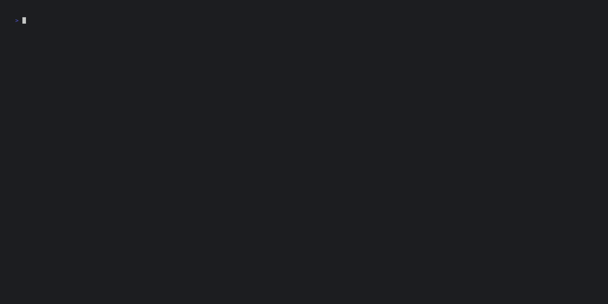

# flamelens

`flamelens` is an interactive flamegraph viewer in the terminal.



## What is it?

Flamegraph tools such as [FlameGraph](https://github.com/brendangregg/FlameGraph) and
[inferno](https://github.com/jonhoo/inferno) process output from various profiling tools and
generate intermediate data in the "folded" format ready for flamegraph plotting. Instead of plotting
the flamegraph as an SVG file, `flamelens` takes the folded stacks data and generate an interactive
flamegraph in the terminal.

No more hauling SVG files and opening a browser just to have a quick look at the profiling result!

## Usage

Run `flamelens` with the filename of the profiling data in the form of "folded stacks":

```
flamelens <folded-stacks-filename>
```

You can also pipe data directly to `flamelens` without providing a filename.


### cargo-flamegraph

You can use `flamelens` as the viewer of [`cargo flamegraph`](https://github.com/flamegraph-rs/flamegraph) this way:

```
cargo flamegraph --post-process 'flamelens --echo' [other cargo flamegraph arguments]
```

The `--echo` flag ensures that the flamegraph SVG file is also generated by `cargo flamegraph` on
exit.

### Viewing `perf` data
If have a `perf.data` file generated by `perf` (e.g. by using `cargo flamegraph` to profile your
program in Linux), you can visualize it in `flamelens` this way with the help of
[inferno](https://crates.io/crates/inferno):

```
perf script -i perf.data | inferno-collapse-perf | flamelens
```

See [inferno](https://crates.io/crates/inferno) on generating folded stacks data from profiling data
of different formats.

### Python

Display a live flamegraph of a running Python program using
[`py-spy`](https://github.com/benfred/py-spy) as the profiler:

```
flamelens --pid <pid-of-python-program>
```

This requires enabling the `python` feature when installing.

Example of a live flamegraph:


## Key bindings
Key | Action
--- | ---
`hjkl` (or `← ↓ ↑→ `) | Navigate cursor for frame selection
`f` | Scroll down
`b` | Scroll up
`G` | Scroll to bottom
`g` | Scroll to top
`Enter` | Zoom in on the selected frame
`Esc` | Reset zoom
`/<regex>` | Find and highlight frames matching the regex
`#` | Find and highlight frames matching the selected frame
`n` | Jump to next match
`N` | Jump to previous match
`r` | Reset to default view
`z` (in Live mode) | Freeze the flamegraph
`q` (or `Ctrl + c`) | Exit

## Installation

If you have [Rust](https://www.rust-lang.org/tools/install) installed, `flamelens` is available on
[crates.io](https://crates.io/crates/flamelens) and you can install it using:

```
cargo install flamelens --locked
```

If you want the live flamegraph functionality, install with the `--all-features` option:
```
cargo install flamelens --locked --all-features
```

Note: Compiling with `--all-features` option may require `libunwind` to be installed on your system.

Alternatively, build and install from source after cloning this repo:
```
cargo install --path $(pwd) --locked
```

### Distro Packages

#### Arch Linux

You can install from the [extra repository](https://archlinux.org/packages/extra/x86_64/flamelens/) using `pacman`:

```
pacman -S flamelens
```
